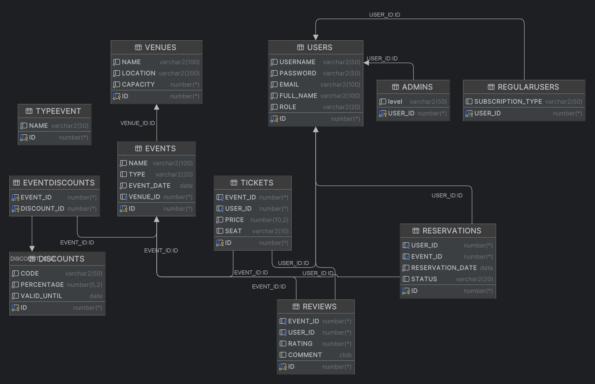

# E-Ticketing Java Application

## Descrierea aplicatiei
Aceasta este o aplicație de e-ticketing care permite utilizatorilor să rezerve bilete pentru diverse evenimente. Utilizatorii pot crea conturi, pot vizualiza evenimente disponibile, pot cumpăra bilete, anula bilete și pot lăsa recenzii pentru evenimentele la care au participat. Aplicația include funcționalități de gestionare a locațiilor, rezervărilor, recenziilor, reducerilor și tipurilor de evenimente.

## Documentația Modelului
Vizitați [Website-ul Documentației Modelului](https://projectpao-6455c.web.app) pentru informații detaliate despre modelele utilizate în acest proiect.

## Diagrama Bazei de Date

Imaginea de mai sus ilustrează structura bazei de date utilizată în acest proiect.

## Lista de Acțiuni/Interogari Posibile
- **CREARE cont utilizator**
- **ȘTERGERE cont utilizator**
- **ACTUALIZARE cont utilizator**
- **ADĂUGARE evenimente**
- **ȘTERGERE evenimente**
- **VIZUALIZARE evenimente disponibile**
- **CUMPĂRARE bilete**
- **ANULARE bilete**
- **ADĂUGARE recenzii pentru evenimente**
- **VIZUALIZARE locații**
- **VIZUALIZARE recenzii**
- **VIZUALIZARE rezervari**
- **VIZUALIZARE reduceri**
- **AUDIT al acțiunilor efectuate în baza de date**

## Tipuri de Obiecte
- Utilizator
- Eveniment
- Bilet
- Locație (Venue)
- Reducere (Discount)
- Rezervare
- Recenzie (Review)
- Tip Eveniment (TypeEvent)
